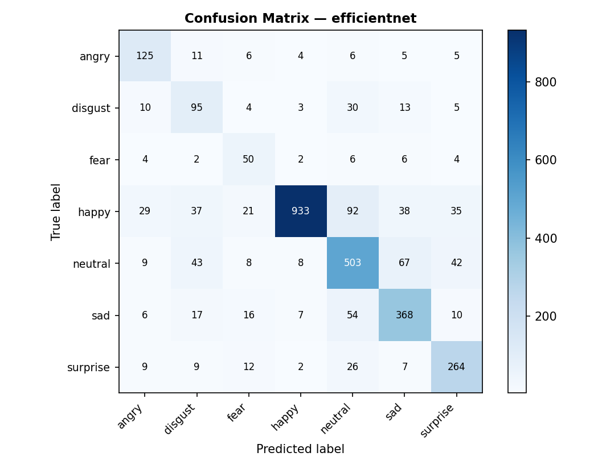

# Facial Emotion Recognition

7-class emotion classifier comparing a custom CNN baseline against EfficientNet-B0 with transfer learning, trained on FERplus and RAF-DB.

**EfficientNet-B0 — 76.2% accuracy · 0.69 macro F1 · ~35 ms CPU inference**



---

## Overview

The core question this project investigates: *how much does transfer learning matter for facial emotion recognition when fine-tuning data is limited (~12k images)?*

Two models are compared:

| Model | Params | Test Accuracy | Macro F1 | CPU Inference |
|---|---|---|---|---|
| Custom CNN (baseline) | 4.9M | 34.9% | 0.295 | ~20 ms |
| EfficientNet-B0 | 5.3M | **76.2%** | **0.691** | ~35 ms |

The CNN collapse in Phase 2 (Focal Loss + severe class imbalance + random initialization) is intentional and quantifies the transfer learning gain: **+41 points of accuracy**.

---

## Datasets

| | FERplus (Microsoft) | RAF-DB |
|---|---|---|
| Images | ~78 300 | ~15 300 |
| Resolution | 112×112 px | ~100×100 px |
| Modality | Grayscale | RGB, in the wild |
| Annotators | 10 | 40 |
| Class balance | Moderate | Skewed (happy: 39%) |
| Role | Phase 1 pre-training | Phase 2 fine-tuning + test |

Download both datasets automatically:

```bash
python download_datasets.py   # requires KAGGLE_USERNAME and KAGGLE_KEY env vars
```

---

## Preprocessing

A unified pipeline is applied to both datasets before training:

```
Raw image → Grayscale → Resize 112×112 → CLAHE → Normalize [0,1] → Pseudo-RGB (×3) → ImageNet norm
```

**CLAHE** (clip=2.0, grid=8×8) is the key step: it enhances local contrast in discriminative regions (eyes, mouth, eyebrows) without amplifying noise in flat areas — critical for in-the-wild RAF-DB images.

```bash
python preprocess.py
```

---

## Training Strategy

Training is split into two phases to leverage both datasets:

```
Phase 1 — FERplus (volume, controlled conditions)
  └─ 8 epochs · AdamW lr=1e-3 · CrossEntropy + class weights · 3 stages unfrozen

Phase 2 — RAF-DB (quality, in the wild)
  └─ 50 epochs · AdamW lr=1e-4 · Focal Loss (γ=2) · CosineAnnealingLR · 4 stages unfrozen
```

Class imbalance (happy: 39%, disgust/fear: 2.3% each) is handled by three complementary mechanisms:
- `WeightedRandomSampler` — equalizes class frequency per batch
- Class-weighted loss (Phase 1) — inverse frequency weights in CrossEntropy
- Focal Loss γ=2 (Phase 2) — down-weights easy examples

Training runs on Google Colab (GPU): [`train.ipynb`](train.ipynb)

---

## Results

### Per-class performance (EfficientNet-B0, RAF-DB test set)

| Emotion | Precision | Recall | F1 | Support |
|---|---|---|---|---|
| angry | 0.651 | 0.772 | 0.706 | 162 |
| disgust | 0.444 | 0.594 | 0.508 | 160 |
| fear | 0.427 | 0.676 | 0.524 | 74 |
| happy | 0.973 | 0.787 | 0.870 | 1185 |
| neutral | 0.702 | 0.740 | 0.720 | 680 |
| sad | 0.730 | 0.770 | 0.750 | 478 |
| surprise | 0.723 | 0.802 | 0.761 | 329 |
| **macro avg** | **0.664** | **0.734** | **0.691** | 3068 |

Happy, surprise, and sad benefit from strong visual cues and sufficient training support. Disgust and fear are hardest due to their low representation (2.3% each) and visual ambiguity with adjacent classes.

Training curves, per-epoch logs, and the full confusion matrix are available in [`results/`](results/).

---

## Demo App

An interactive Streamlit app lets you test the model without any ML setup:

```bash
streamlit run app.py
```

**Demo tab** — upload an image or take a webcam photo, get the predicted emotion with confidence score and full probability distribution across all 7 classes. A collapsible section shows the CLAHE-preprocessed image to illustrate the pipeline.

**Results tab** — training curves (Phase 1 & 2), confusion matrix, and per-class metrics for the selected model and checkpoint.

The sidebar lets you switch between EfficientNet-B0 and the CNN baseline, and between Phase 1 (FERplus) and Phase 2 (RAF-DB) checkpoints.

---

## Project Structure

```
├── app.py                  # Streamlit demo
├── train.ipynb             # Training notebook (Google Colab)
├── preprocess.py           # Preprocessing pipeline (CLAHE, resize, normalize)
├── explore_datasets.py     # Dataset exploration and distribution plots
├── download_datasets.py    # Kaggle dataset downloader
├── requirements.txt
└── results/
    ├── efficientnet/       # Weights, curves, confusion matrix, logs
    └── baseline_cnn/
```

---

## Setup

```bash
pip install -r requirements.txt
streamlit run app.py
```

Pre-trained weights are included in `results/` — no training required to run the demo.
